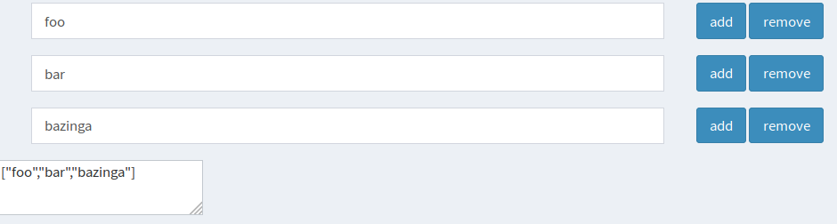
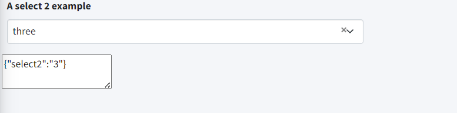

### Example usage

```
<?php 
use tonisormisson\jsonform\JsonForm;

$jsonData = '{"username":"admin","password":"password"}';
$variables = [
    'username'=>[
        'label' => Yii::t('app','Username'),
    ],
    'password'=>[
        'label' => Yii::t('app','Password'),
        'type' => JsonForm::TYPE_PASSWORD,
    ],
];

echo JsonForm::widget([
    'id' => 'my-id',
    'json' => $jsonData,
    'jsonFieldId' => 'my-credentials-input-field',
    'variables' => $variables,
    'labels' => false,
]);

// the filed where the changed json will be stored
// hide this !!
echo Html::textarea('my-credentials-input-field','', ['id' => 'my-credentials-input-field']);

```
#### Output of example above:


### Non keyed version
```
<?php 
use tonisormisson\jsonform\JsonForm;

$jsonData = '["foo", "bar", "bazinga"]';

echo JsonForm::widget([
    'id' => 'my-id',
    'json' => $jsonData,
    'jsonFieldId' => 'my-credentials-input-field',
    'isKeyed' => false,
]);

// the filed where the changed json will be stored
// hide this !!
echo Html::textarea('my-credentials-input-field','', ['id' => 'my-credentials-input-field']);

```


### Example usage Select2

```

// ######################### example 3 select
$jsonData = '{"select2":3}';
$variables = [
    'select2'=>[
        'label' => Yii::t('app','A select 2 example'),
        'type' => JsonForm::TYPE_SELECT2,
        'select' => [
            1 => "one",
            2 => "two",
            3 => "three"
        ],
        'options' => ['placeholder' => 'Select a number ...'],
        'pluginOptions' => [
            'allowClear' => true
        ]
    ],
];

echo JsonForm::widget([
    'id' => 'my-id-3',
    'json' => $jsonData,
    'jsonFieldId' => 'my-credentials-input-field-3',
    'variables' => $variables,
]);
echo Html::textarea('my-credentials-input-field-3','', ['id' => 'my-credentials-input-field-3']);
```



