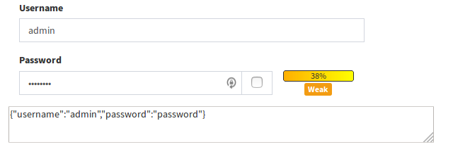

### Example usage

```
<?php 
use tonisormisson\jsonform\JsonForm;

$jsonData = '{"username":"admin","password":"password"}';
$variables = [
    'username'=>[
        'label' => Yii::t('app','Username'),
    ],
    'password'=>[
        'label' => Yii::t('app','Password'),
        'type' => JsonForm::TYPE_PASSWORD,
    ],
];

echo JsonForm::widget([
    'json'=>$jsonData,
    'jsonFieldId'=>'credentials',
    'variables' => $variables,
]); 

```
#### Output of example above:

